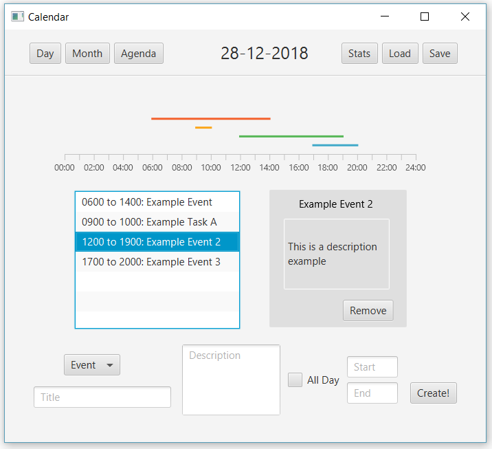
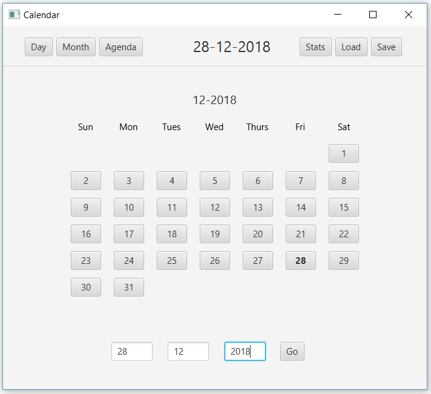
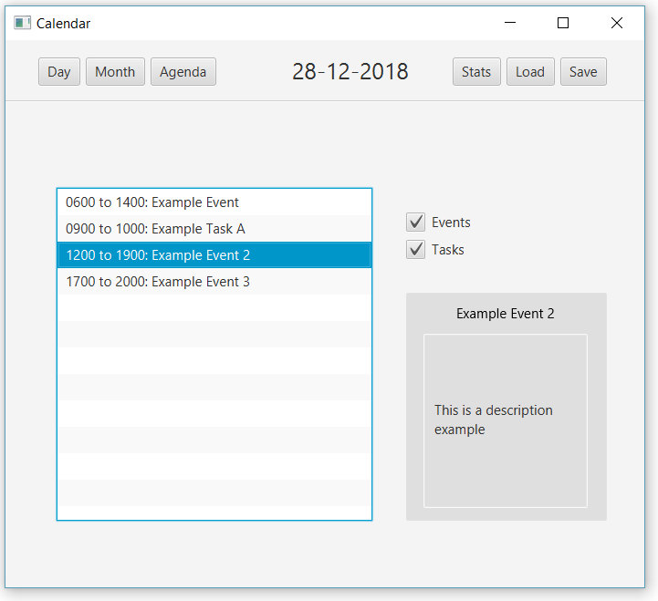

### Calendar Personal Project
### UBC CPSC 210 Term Project

For UBC Computer Science's "Software Construction" course (CPSC 210) the students are required to complete a project of their own design, making weekly contributions based on the week's coursework. We had weekly "deliverables", all which were satisfied by this project for a perfect assignment grade

My project, created with Java 8, Maven, FXML and Gson (Json Library) is a desktop calendar app. The user has the option to view their daily schedule at a glance, and add or remove events on the primary "Day" page. The default starting day is the current day in the user's local timezone: 

The user can select a new day to view on the "Month" page:

Finally, the user can see all Events, Tasks, or both, sorted in cronological order from today onward in the "Agenda" page:

 

---

The below information is each weekly assigned deliverable, the main goals, and what changed about my project to complete them: 

**Deliverable 1: Basic Interaction**
> Get basic interaction loop going, use at least one class, and must have multiple methods that are called. 

Used a while loop and string equals to get user input and called basic methods from that

**Deliverable 2: Abstraction and Testing**
> In this phase, you are to decide on at least one data abstraction (a Class) that captures the central element (or elements, if you want, but you need at least one) of your system. Write a separate class that tests every method your data abstraction or data abstractions.

Added 4 classes: Calendar, Day, Date, Event. Calendar contained a TreeMap of Days, sorted by Date. Each day had a list of Events

**Deliverable 3: Types, Interfaces and Saving**
> You need to save the state of your class or classes to a file, and be able to re-load the state of the class or classes from a file (so that a user can keep going where they left off).  Write tests that ensure the file load and save methods are functioning correctly.

Basic File I/O, add to each object to print out, returning a parseable String. Calendar would iterate through it's map, calling that method on each Date/Day and aggregating the Strings, saving them to a "cal.txt" in project path

> You must introduce at least two interfaces, and have one class that implement at least two interfaces.

Introduced a "Saveable" interface to print in a parseable way, and a "Display" interface with a custom printable method

> You need to write tests for the methods in the interfaces. It's up to you whether you make specific test classes for each interface, or, as is more common in industry, augment the testing of the implementation class to cover the Interface methods.

Achieved 100% code-coverage with testing for all methods in the system

**Deliverable 4: Abstracts and Extends**
> You must introduce at least one abstract class. The abstract class should have at least one abstract method. Extend this abstract class with at least 2 classes
 
Event was abstracted into "CalEvent", with two children: Event and Task. Days now contained a list of CalEvents

**Deliverable 5: Robustness**
> Create an multiple exceptions and an exception hierarchy with multiple levels of try/catch statements
 
Created the InvalidDateException (thrown by date) and the InvalidSaveFileException, thrown by each object in the system and caught at the correct level to continue parseing an "invalid" file

**Deliverable 6: Draw Out Your Design**
> Draw a UML class diagram of your system. Include all the classes in your system, all type-hierarchy relationships and associations. Include all methods in every class box. Choose one starting method and draw a sequence diagram of its execution

**Deliverable 7: Data Relationships**
> Setup a reflexive relationship within your system. Override equals and hashcode to make this work.

There was already a 1:1 reflexive relationship with Days and Dates within the Calendar object's singular TreeMap. Nothing needed to be done that week

**Deliverable 8: Design Principles**
> Do a cohesion analysis of your system to identify areas of low cohesion. Refactor those classes to be cohesive. Do a coupling analysis of the central classes of your system. Refactor those classes if there is a lot of coupling between classes. Use delegation if you've found methods violating LSP

After a meaty on-paper analysis and discussion with my TA mentor, all of my classes were cohesive, not coupled nor violated LSP. Nothing needed to be done that week

**Deliverable 9: Design Patterns and the Web**
> Implement the Observer or Composite design pattern within your system

Added a StatisticObserver object to track number of Calendar entries added or removed each session. Also implemented the Singleton design pattern by refactoring my Calendar object.

> Parse JSON or XML data from an external API 

Added a TimeZone object to Calendar, which used the local IP address to get the user's longitude and latitude by looking it up in Maxmind's GeoLite database. The object then queries Google's Timezone API with this information.

**Deliverable 10: Interactivity and Visuals**
> Add a GUI. Incorporate UI elements such as buttons, and text boxes, a map, creative use of sounds, or visualisations, as appropriate for your application.  Make creative use of visualisation where you can.

Used FXML to build a multi-stage application with several different controllers. All the buttons and lists are FXML native objects. This deliverable was given 2 weeks to be finished, which didn't leave enough time for styling. However, although it wasn't the cleanest looking, the app is fully functional
